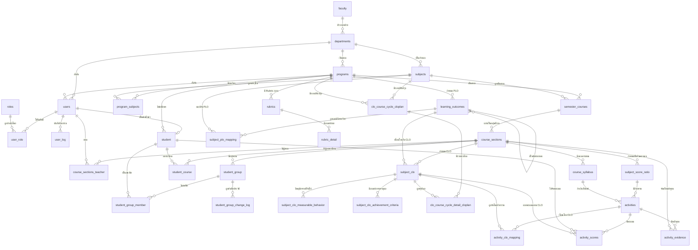
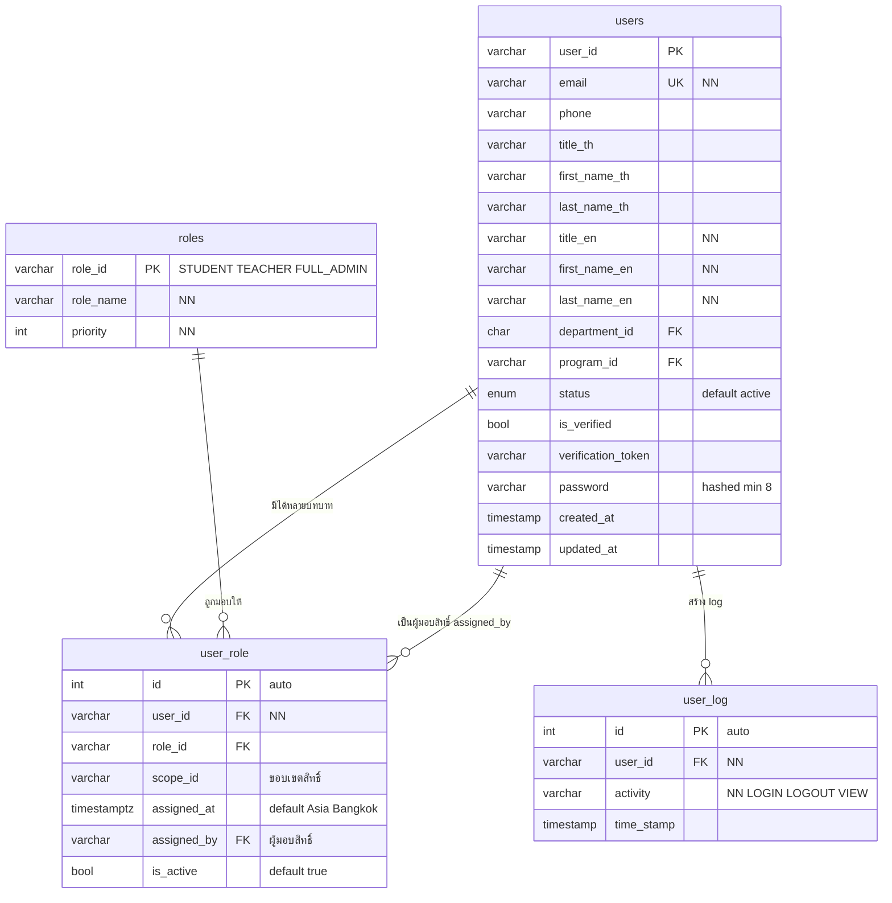
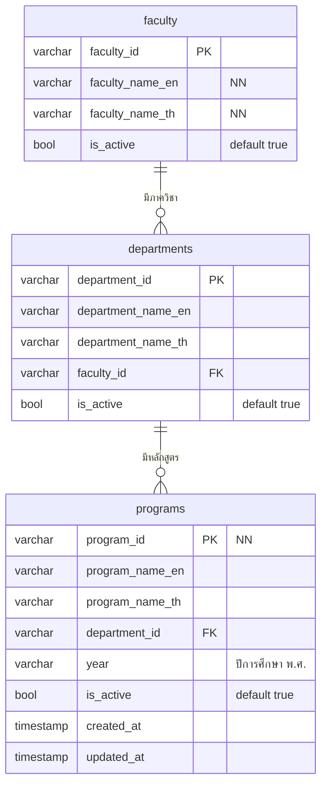
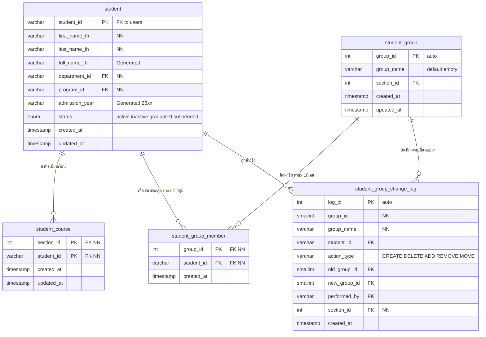
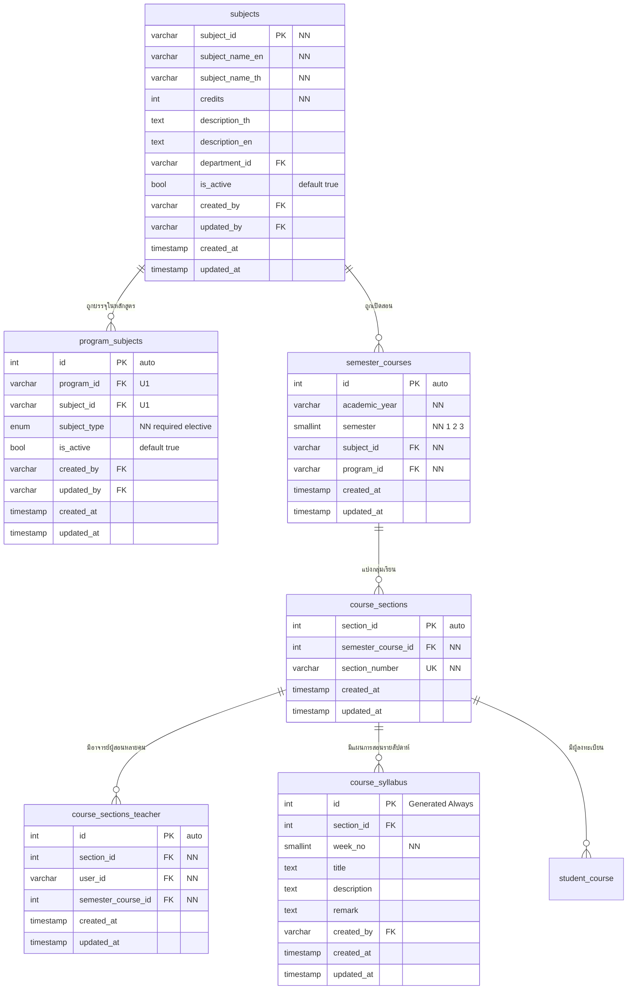
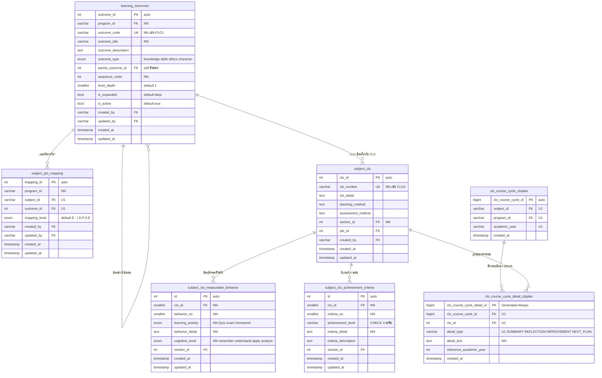
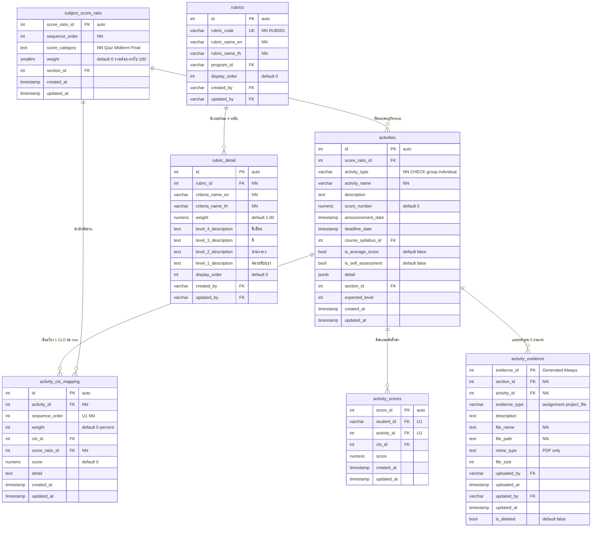

# DEEP-Core — ER Diagram

> แผนภาพความสัมพันธ์ของข้อมูล (Entity Relationship Diagram) ในรูปแบบ **Mermaid `erDiagram`**
> ซึ่งเป็นรูปแบบที่เหมาะสมกับเอกสาร Markdown เพราะ render ได้บน GitHub / VS Code / Artifact โดยตรง และ diff ได้เหมือนโค้ด
> อ้างอิงจาก §3.5 รูป 3.78–3.84 · รายละเอียดฟิลด์อยู่ใน [`02-database-schema.md`](./02-database-schema.md)

**Cardinality notation ที่ใช้**

| สัญลักษณ์ | ความหมาย |
|---|---|
| `||--o{` | one-to-many (ฝั่งลูกมีได้ 0..N) |
| `||--||` | one-to-one |
| `}o--||` | many-to-one (ฝั่งซ้ายมีได้ 0..N) |
| `||--o|` | one-to-zero-or-one |

---

## 1. ภาพรวมทั้งระบบ (Whole-system ERD — รูป 3.78)



---

## 2. โมดูลผู้ใช้งานและสิทธิ์ (รูป 3.79)



---

## 3. โมดูลโครงสร้างองค์กร (รูป 3.80)



---

## 4. โมดูลนักศึกษา (รูป 3.81)



---

## 5. โมดูลรายวิชาและการเปิดสอน (รูป 3.82)



---

## 6. โมดูลผลการเรียนรู้ PLO / CLO (รูป 3.83)



---

## 7. โมดูลกิจกรรม คะแนน และ Rubric (รูป 3.84)



---

## 8. สรุปความสัมพันธ์หลักเชิงธุรกิจ

```
faculty (1) ─── (N) departments (1) ─── (N) programs
                                              │
                          ┌───────────────────┼─────────────────────┐
                          │                   │                     │
                   learning_outcomes    program_subjects        student
                    (PLO tree)                │                     │
                          │                   │                     │
                   subject_plo_mapping ── subjects                  │
                          │                   │                     │
                          │            semester_courses             │
                          │                   │                     │
                          │            course_sections ──── student_course
                          │                   │                     │
                          └──────────── subject_clo           student_group
                                              │                     │
                                    ┌─────────┴─────────┐   student_group_member
                                    │                   │
                    measurable_behavior     achievement_criteria
                                              │
                                subject_score_ratio ─── activities
                                                            │
                                       ┌────────────────────┼──────────────────┐
                              activity_clo_mapping   activity_scores   activity_evidence
```

**เส้นทางการคำนวณผลการบรรลุผล (Data Flow):**

```
activity_scores (คะแนนดิบ)
   └─▶ activity_clo_mapping (weight %)   ─▶ คะแนน CLO รายบุคคล (สเกล 5)
          └─▶ subject_clo_achievement_criteria (4 ระดับ)  ─▶ ผ่าน/ไม่ผ่าน (เกณฑ์ > 60%)
                 └─▶ subject_clo.plo_id ─▶ learning_outcomes ─▶ คะแนน PLO ระดับหลักสูตร
                        └─▶ แสดงผล: Radar Chart / Heatmap / Sankey Diagram / รายงาน PDF
```

---

## 9. หมายเหตุ

- ERD นี้ครอบคลุมเฉพาะ **32 ตารางที่มีคำอธิบายฟิลด์ในตาราง 3.3–3.34** ของปริญญานิพนธ์
  ตารางที่ปรากฏเฉพาะใน ERD รวม (รูป 3.78) โดยไม่มีรายละเอียดฟิลด์ ถูกระบุไว้ในหัวข้อ 9 ของ [`02-database-schema.md`](./02-database-schema.md)
- ชนิดข้อมูลใน Mermaid block ถูกย่อ (เช่น `varchar` แทน `Varchar(100)`) เนื่องจากข้อจำกัดของไวยากรณ์ Mermaid — ความยาวจริงดูได้ที่ไฟล์ schema
- ข้อสังเกตเรื่อง Unique constraint ที่อาจกว้างเกินไป (`section_number`, `clo_number`, `outcome_code`) ระบุไว้ในหัวข้อ 9 ของไฟล์ schema เช่นกัน

---

**ไฟล์ที่เกี่ยวข้อง:** [`01-requirements.md`](./01-requirements.md) · [`02-database-schema.md`](./02-database-schema.md) · [`04-test-cases-v0.1.md`](./04-test-cases-v0.1.md) · [`05-screen-api-mapping.md`](./05-screen-api-mapping.md)
