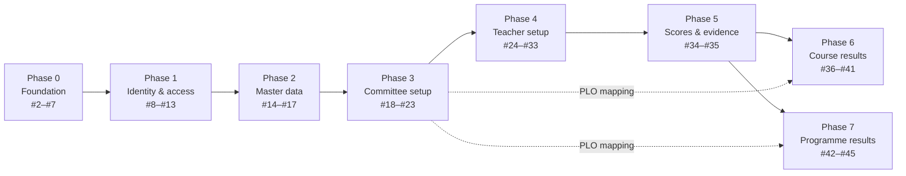

# DEEP-Core — Ticket Breakdown

> The rebuild of DEEP-Core, broken into 44 tracer-bullet tickets across 8 phases.
> Derived from [`06-implementation-plan.md`](./06-implementation-plan.md), which is the spec these tickets implement.
> Decisions behind them: [`CONTEXT.md`](../CONTEXT.md) · [ADR-0001](./adr/0001-three-tier-key-strategy.md) ·
> [ADR-0002](./adr/0002-server-side-rbac.md) · [ADR-0003](./adr/0003-clo-belongs-to-program-subject-year.md)

| | |
|---|---|
| **Tracker** | GitHub Issues — [`khthana/Deep-QA`](https://github.com/khthana/Deep-QA/issues) |
| **Spec (parent)** | [#1](https://github.com/khthana/Deep-QA/issues/1) |
| **Tickets** | [#2](https://github.com/khthana/Deep-QA/issues/2)–[#45](https://github.com/khthana/Deep-QA/issues/45) — 44 in total. Gaps found while building are opened as new issues above #45 and are not folded back in here; GitHub is the live list. |
| **Triage label** | `ready-for-agent` on every ticket |
| **Blocking edges** | 57, recorded as GitHub *native issue dependencies* — not as body text |
| **Published** | 2026-08-16 |

---

## 1. How the tickets are shaped

Each ticket is a **tracer bullet**: one narrow but complete path through schema, API, screen and tests, verifiable on
its own. With few exceptions that means **one ticket per screen**. The six foundation tickets are the exception —
they are prefactoring, and deliver infrastructure rather than user-visible behaviour.

### No wide refactor, by construction

Two changes in this project have a blast radius across the whole codebase: removing the 448 places where the schema
name is concatenated into SQL strings, and adding authorisation to 130 endpoints. Normally each would need an
expand–contract sequence — add the new form beside the old, migrate call sites in batches, delete the old form — to
keep the build green throughout.

Neither needs it here. Because the rebuild **copies files into a fresh tree one ticket at a time**
(see [`06-implementation-plan.md`](./06-implementation-plan.md)), both changes are absorbed into whichever ticket
copies the file. No ticket ever leaves the tree broken, so every ticket is a plain vertical slice.

### What every ticket carries

- **What to build** — the end-to-end behaviour, from the user's perspective
- **Acceptance criteria** — checkable statements, written so that a rule is *proved*, not merely present. Permission
  rules are phrased as "refused at the server", because the defect being corrected is precisely a system whose access
  control existed only in the interface.
- **Blocked by** — the tickets that genuinely gate it

Ticket bodies deliberately avoid file paths and code snippets, which go stale. Those live in
[`05-screen-api-mapping.md`](./05-screen-api-mapping.md).

---

## 2. Phase overview



Phases 6 and 7 both depend on Phase 5, and run in parallel once it lands.

---

## 3. The tickets

### Phase 0 · Foundation — #2–#7

Prefactoring. Delivers no screen; delivers the ground every screen stands on.

| Issue | Title | Blocked by | Delivers |
|---|---|---|---|
| [#2](https://github.com/khthana/Deep-QA/issues/2) | Local PostgreSQL and migration runner | — | Compose file, numbered SQL migrations, reset/migrate scripts, schema name set on the connection search path |
| [#3](https://github.com/khthana/Deep-QA/issues/3) | Schema: identity and organisation | #2 | Faculty, Department, Program, Subject, Program Subject, student register, users, roles, grants, activity log |
| [#4](https://github.com/khthana/Deep-QA/issues/4) | Schema: offerings and learning outcomes | #3 | Offerings, Sections, teaching assignments, teaching plan, PLOs, outcome mapping, CLOs and their children |
| [#5](https://github.com/khthana/Deep-QA/issues/5) | Schema: assessment, scores and rubrics | #4 | Enrolment, Work Groups, weighting scheme, Activities, marks, Evidence, Rubrics |
| [#6](https://github.com/khthana/Deep-QA/issues/6) | Seed dataset for development and acceptance | #5 | One complete scenario plus two academic years of marks and the named acceptance accounts |
| [#7](https://github.com/khthana/Deep-QA/issues/7) | Backend skeleton and test harness | #2 | App/listener split, test runner, schema-per-run, fixture builders, one smoke test |

### Phase 1 · Identity and access — #8–#13

| Issue | Title | Blocked by | Delivers |
|---|---|---|---|
| [#8](https://github.com/khthana/Deep-QA/issues/8) | Sign in | #6, #7 | Google and password sign-in, domain and role checks, session cookie, activity logging |
| [#9](https://github.com/khthana/Deep-QA/issues/9) | Server-side authorisation | #8 | Role/scope middleware reading grants from the database — **ADR-0002** |
| [#10](https://github.com/khthana/Deep-QA/issues/10) | Application shell, role switching and sidebar | #9 | Navigation, role-aware sidebar, role switching, idle expiry, password change |
| [#11](https://github.com/khthana/Deep-QA/issues/11) | User accounts | #10 | Account CRUD, spreadsheet import, deactivation, External Assessor validity windows |
| [#12](https://github.com/khthana/Deep-QA/issues/12) | Role grants | #11 | Multi-role grants with scope, and the "never exceed the granter's scope" rule |
| [#13](https://github.com/khthana/Deep-QA/issues/13) | User activity history | #11 | Per-user activity log, scoped to the reader |

### Phase 2 · Master data — #14–#17

| Issue | Title | Blocked by | Delivers |
|---|---|---|---|
| [#14](https://github.com/khthana/Deep-QA/issues/14) | Departments | #10 | Department CRUD, Faculty-Admin-only enforcement, **and the shared spreadsheet-import module** |
| [#15](https://github.com/khthana/Deep-QA/issues/15) | Programs | #14 | Program CRUD, per-Department scoping, deactivate-instead-of-delete |
| [#16](https://github.com/khthana/Deep-QA/issues/16) | Subjects | #14 | Subject catalogue with code, credits, bilingual names, description |
| [#17](https://github.com/khthana/Deep-QA/issues/17) | Central student register | #15 | Student browse **plus the add/import capability the inherited screen never wired** |

### Phase 3 · Curriculum Committee setup — #18–#23

| Issue | Title | Blocked by | Delivers |
|---|---|---|---|
| [#18](https://github.com/khthana/Deep-QA/issues/18) | Program Subjects | #15, #16 | Subjects placed into a Program as required or elective |
| [#19](https://github.com/khthana/Deep-QA/issues/19) | Programme Learning Outcomes | #15 | PLO tree with types and ordering, codes unique per Program |
| [#20](https://github.com/khthana/Deep-QA/issues/20) | Outcome-to-Subject mapping | #18, #19 | The five-level coverage grid and its Thai-font PDF export |
| [#21](https://github.com/khthana/Deep-QA/issues/21) | Rubrics | #15 | Reusable Program-owned scoring guides |
| [#22](https://github.com/khthana/Deep-QA/issues/22) | Rubric criteria | #21 | Weighted criteria described at four levels |
| [#23](https://github.com/khthana/Deep-QA/issues/23) | Offerings and Sections | #18, #11 | Opening Subjects for a term, Sections, teaching assignments, copy-from-previous-term |

### Phase 4 · Teacher setup — #24–#33

| Issue | Title | Blocked by | Delivers |
|---|---|---|---|
| [#24](https://github.com/khthana/Deep-QA/issues/24) | Teacher dashboard and Section context | #23 | Section picker; Section-specific menus appear only once a Section is chosen |
| [#25](https://github.com/khthana/Deep-QA/issues/25) | Section enrolment | #24, #17 | Class list, import, and refusal of students absent from the central register |
| [#26](https://github.com/khthana/Deep-QA/issues/26) | Work Groups | #25 | Groups with the ten-member and one-group-per-student limits, plus change history |
| [#27](https://github.com/khthana/Deep-QA/issues/27) | Course Learning Outcomes | #24, #19 | CLO set at the Program/Subject/year grain, shared across Sections — **ADR-0003** |
| [#28](https://github.com/khthana/Deep-QA/issues/28) | Measurable Behaviors | #27 | Observable behaviours per CLO with cognitive levels |
| [#29](https://github.com/khthana/Deep-QA/issues/29) | Achievement Criteria | #27 | Four-band criteria per CLO |
| [#30](https://github.com/khthana/Deep-QA/issues/30) | Weighting scheme | #24 | Categories totalling 100, shared across Sections — **ADR-0003** |
| [#31](https://github.com/khthana/Deep-QA/issues/31) | Teaching plan | #24 | Week-by-week plan per Section |
| [#32](https://github.com/khthana/Deep-QA/issues/32) | Activity list | #30, #31 | Activities grouped by weighting category |
| [#33](https://github.com/khthana/Deep-QA/issues/33) | Activity editor | #32, #27 | Activity definition and its per-CLO weight attribution |

### Phase 5 · Scores and evidence — #34–#35

| Issue | Title | Blocked by | Delivers |
|---|---|---|---|
| [#34](https://github.com/khthana/Deep-QA/issues/34) | Activity marks | #33, #25, #26 | Both entry toggles, spreadsheet import with its four validation checks, update-not-duplicate |
| [#35](https://github.com/khthana/Deep-QA/issues/35) | Assessment evidence | #33 | Five evidence types **plus real PDF enforcement and authenticated file retrieval** |

### Phase 6 · Course-level results — #36–#41

| Issue | Title | Blocked by | Delivers |
|---|---|---|---|
| [#36](https://github.com/khthana/Deep-QA/issues/36) | Section results | #34, #20 | Section radar, year-over-year comparison, headline figures, **and the rewrite of the broken student-list hook** |
| [#37](https://github.com/khthana/Deep-QA/issues/37) | Individual student results | #34 | Per-student radar against the Section average, up to ten CLOs |
| [#38](https://github.com/khthana/Deep-QA/issues/38) | Learning detail heatmap | #34 | Student-by-CLO heatmap on the five colour bands, with CLOs needing attention listed |
| [#39](https://github.com/khthana/Deep-QA/issues/39) | Outcome-to-Activity map | #34 | Flow diagram of CLO-to-Activity coverage with counts and a detail table |
| [#40](https://github.com/khthana/Deep-QA/issues/40) | CLO assessment report | #34, #29 | Formal assessment table with pass determination, exported as PDF |
| [#41](https://github.com/khthana/Deep-QA/issues/41) | Continuous improvement plan | #27 | The four-part yearly improvement record |

### Phase 7 · Programme-level results — #42–#45

| Issue | Title | Blocked by | Delivers |
|---|---|---|---|
| [#42](https://github.com/khthana/Deep-QA/issues/42) | Programme-level results by intake | #34, #20 | Cohort PLO roll-up with drill-down to Activities and evidence; **renames `courseLevel*` to `programLevel*`** |
| [#43](https://github.com/khthana/Deep-QA/issues/43) | Programme-level results for all students | #42 | Whole-cohort heatmap |
| [#44](https://github.com/khthana/Deep-QA/issues/44) | Programme-level comparison across intakes | #42 | Multi-year trend |
| [#45](https://github.com/khthana/Deep-QA/issues/45) | Programme-level results for one student | #42, #17 | Single-student PLO attainment with drill-down |

---

## 4. Dependency graph

All 57 edges, as `child ← blocker`:

```
#3  ← #2                 #18 ← #15, #16          #33 ← #32, #27
#4  ← #3                 #19 ← #15               #34 ← #33, #25, #26
#5  ← #4                 #20 ← #18, #19          #35 ← #33
#6  ← #5                 #21 ← #15               #36 ← #34, #20
#7  ← #2                 #22 ← #21               #37 ← #34
#8  ← #6, #7             #23 ← #18, #11          #38 ← #34
#9  ← #8                 #24 ← #23               #39 ← #34
#10 ← #9                 #25 ← #24, #17          #40 ← #34, #29
#11 ← #10                #26 ← #25               #41 ← #27
#12 ← #11                #27 ← #24, #19          #42 ← #34, #20
#13 ← #11                #28 ← #27               #43 ← #42
#14 ← #10                #29 ← #27               #44 ← #42
#15 ← #14                #30 ← #24               #45 ← #42, #17
#16 ← #14                #31 ← #24
#17 ← #15                #32 ← #30, #31
```

### Critical path

17 tickets long. Everything else branches off it and can run in parallel.

```
#2 → #3 → #4 → #5 → #6 → #8 → #9 → #10 → #14 → #15 → #18 → #23 → #24 → #27 → #33 → #34 → #42
```

Note the shape: the chain is dominated by the foundation and by the single-file spine of the curriculum
(Program → Program Subject → Offering → Section → CLO → Activity → mark). The screens that merely *read* that data —
all of Phase 6, and #43–#45 — hang off the end and parallelise widely.

### Finding what is ready to start

The blocking edges are native GitHub dependencies, so the frontier is queryable rather than something to work out by
hand. A ticket is ready when its open-blocker count is zero:

```bash
for n in $(seq 2 45); do
  b=$(gh api repos/khthana/Deep-QA/issues/$n --jq '.issue_dependencies_summary.blocked_by // 0')
  [ "$b" = "0" ] && gh issue view $n --json number,title --jq '"#\(.number)  \(.title)"'
done
```

At publication the frontier held exactly one ticket: **#2, Local PostgreSQL and migration runner**.

---

## 5. Deliberate omissions

| Not a ticket | Why |
|---|---|
| The placeholder course-list screen | No menu entry, no endpoints, no content — dropped rather than rebuilt |
| The ~18 thesis-only tables | No code touches them; they are not created |
| The 25 endpoints with no caller | Not copied into the new tree. They remain in the reference tree if a later ticket proves one is needed — except the student add/import pair, which is uncalled only because the buttons were never wired, and which #17 connects |
| Frontend component tests | The UI is carried over unchanged by instruction, so component tests would pin down markup nobody designed here |
| A separate seam for the scoring services | Their rules are asserted through the results endpoints; see the spec's testing section |
| Google OAuth for local development | Development sign-in uses passwords for all roles; the OAuth path is exercised only once a staging environment exists |

---

## 6. Where the risky work sits

Three tickets carry more than their share of the project's risk, and are worth scheduling when there is attention to
spare rather than at the end of a week.

- **#9 Server-side authorisation** — every ticket after it inherits its guards. If its scope model is wrong, forty
  screens are wrong quietly.
- **#34 Activity marks** — two orthogonal entry toggles, a four-check import, and upsert semantics, on the table every
  results screen reads from.
- **#42 Programme-level results by intake** — establishes the roll-up that #43–#45 reuse, and is the first screen
  where a normalisation error becomes visible as a plausible-looking wrong number rather than a crash.

---

**Related:** [`01-requirements.md`](./01-requirements.md) · [`02-database-schema.md`](./02-database-schema.md) ·
[`03-er-diagram.md`](./03-er-diagram.md) · [`04-test-cases-v0.1.md`](./04-test-cases-v0.1.md) ·
[`05-screen-api-mapping.md`](./05-screen-api-mapping.md) · [`06-implementation-plan.md`](./06-implementation-plan.md)
